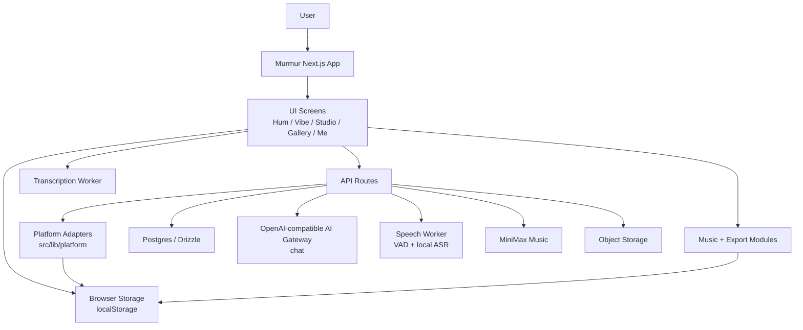

# Murmur Architecture

Murmur is a single-product Next.js app with a small local platform layer. The
goal of this document is not to freeze the design forever; it is to make the
current system legible enough that new work can ship without rediscovering the
same boundaries each week.

This document keeps the useful part of the `repo-template` discipline:

- clear visible surfaces
- explicit system boundaries
- small, reviewable changes
- written limits where the product is still stubbed or provisional

## System intent

Murmur turns a melody idea into a saved song artifact. The primary path is
still Hum -> Vibe -> Studio -> Save; the voice-aware branch adds ASR routing so
lyrical Chinese/English singing can become a whole-song MiniMax generation
without disturbing pure-hum melody transcription.

## Design principles

1. Keep product logic in Murmur, not in vendor SDKs.
2. Treat external services as adapters behind narrow interfaces.
3. Prefer guest-safe and demo-safe behavior over hard failure in the UI.
4. Keep the path from hum -> arrangement -> save -> export observable and easy
   to test.

## Primary boundaries

- `src/app/`
  Next.js routes, layout, and API entrypoints.
- `src/components/`
  Product UI and screen-level interaction flows.
- `src/modules/`
  Music, export, and transformation logic with the highest product specificity.
- `src/lib/api/`
  Client-side API access wrappers.
- `src/lib/platform/`
  Local platform adapter for auth, request headers, memory, notifications, and
  AI.
- `src/lib/db/`
  Persistence and query layer.

## C4 snapshot

## Runtime flow

### 1. Capture and transcription

- The user records or loads a melody idea in the Hum flow.
- Live recordings enter `POST /api/capture/analyze`.
- When voice input is disabled, ASR is unconfigured, confidence is low, or the
  take looks like nonsense syllables / pure hum, the route returns `kind:
  "hum"` with the existing audio-worker `TranscriptionResult`.
- When ASR finds lyrical Chinese/English singing, the route returns `kind:
  "voice"` with lyrics and diagnostics. Voice v1 does not promise melody
  preservation; it preserves recognized lyrics and style intent.
- The audio worker still owns Hum note extraction. Murmur normalizes that output
  before it becomes arrangement input.

### 2. Arrangement and editing

- The vibe and studio flows transform melody into arrangement choices.
- `src/modules/` owns the arrangement rules, preview behavior, and export logic.
- `/api/strummer/edit` adds LLM-assisted edit-token classification when a
  compatible AI gateway is configured.
- Hum-generated versions use the Magenta worker as whole generated clips.
  Voice-generated versions use a single MiniMax `music-2.6` result with
  `lyrics + stylePrompt`, then hide TrackMixer/Auris in Studio and show
  whole-song playback plus lyrics.

### 3. Save and playback

- Songs are stored through Next.js API routes and the DB query layer.
- Playback and export reuse the same underlying arrangement model so preview and
  saved artifacts stay aligned.
- Voice songs save `inputKind`, `lyrics`, `generationProvider`, and a stable
  object-storage `mp3Url`. Provider-expiring URLs are never written into saved
  song rows.

### 4. Platform concerns

- Auth is session-based in production.
- Local Creator is a lightweight account with a real `users.id`, a Murmur
  session cookie, and 5 notes once for the current browser. The web client
  creates it on explicit Local Creator entry or before flows that need
  server-side ownership, such as live hum, save, gallery load, song detail, or
  OAuth handoff. Pure guest fallback remains local/dev-only and rate-limited.
  It can own songs, so the Gallery and song detail flows work before
  registration. It is still not a registered account: top-up, payment, account
  deletion, and cross-device sync require binding an external identity.
- When a new user signs in from an unbound Local Creator session, Murmur
  promotes that existing user row instead of copying songs. The `userId` stays
  stable, which keeps saved songs, ledger rows, and future exports attached.
- Invite links carry a registered referrer id in `?ref=`. The browser stores
  that ref in local storage plus a short-lived cookie, but rewards settle only
  in the server-side registration callbacks for brand-new users or Local
  Creator promotions. The `share_referrals` table records attribution and the
  paired `notes_ledger` grant rows, so an existing registered user cannot later
  claim invite credit by opening someone else's link.
- Local-header identity is local/demo only.
- Remote notification delivery is intentionally stubbed until a real push
  backend is chosen. The client owns a local in-app notification inbox plus
  browser alert opt-in for demo-safe save / generation feedback.
- Memory events are stored locally for now, which keeps user flows non-blocking.
- Language is negotiated before first paint from the explicit `murmur.lang`
  cookie first, then the request `Accept-Language` header, then the product
  default (`en`). Client hydration re-checks `localStorage`; if the server only
  had the product default, it can still use `navigator.languages` /
  `navigator.language` before persisting the result to the same cookie. Manual
  language switching remains authoritative. IP geography is intentionally not
  part of language selection; it is only a weak future hint for region/payment
  routing.

## Current constraints

- The platform layer is local-first, but production identity is now
  session-backed rather than header-backed.
- Remote push notification delivery is a stub, useful for wiring but not for
  delivery guarantees. Local in-app notifications are persisted in browser
  storage and browser alerts depend on the user's Notification permission.
- AI editing depends on `OPENAI_API_KEY` or an equivalent gateway key.
- Some UI files are still larger than the final target shape and can be split as
  the product stabilizes.

## What changes deserve an explicit design note

Write a short note or ADR before merging when a change:

- alters saved song schema or compatibility
- changes the hum -> arrangement -> export contract
- adds a new external dependency that affects runtime architecture
- changes auth, notification delivery, or AI gateway ownership
- introduces background jobs or multi-step asynchronous processing
