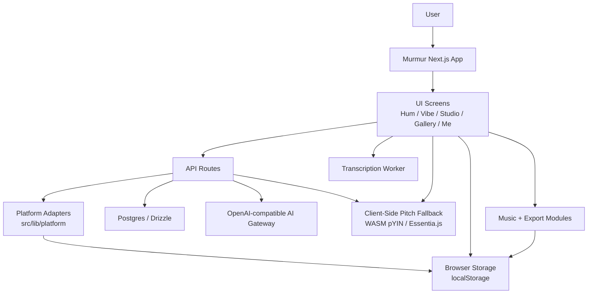

# Murmur Architecture

Murmur is a single-product Next.js app with a small local platform layer. The
goal of this document is not to freeze the design forever; it is to make the
current system legible enough that new work can ship without rediscovering the
same boundaries each week.

This document keeps the useful part of the `repo-template` discipline:

- clear visible surfaces
- explicit system boundaries
- small, reviewable changes
- written limits where the product is still stubbed or provisional

## System intent

Murmur turns a hummed melody into a saved, editable song artifact. The app
captures audio, derives melody candidates, generates arrangements, lets the user
edit and preview them, then saves and exports the result.

## Design principles

1. Keep product logic in Murmur, not in vendor SDKs.
2. Treat external services as adapters behind narrow interfaces.
3. Prefer guest-safe and demo-safe behavior over hard failure in the UI.
4. Keep the path from hum -> arrangement -> save -> export observable and easy
   to test.

## Primary boundaries

- `src/app/`
  Next.js routes, layout, and API entrypoints.
- `src/components/`
  Product UI and screen-level interaction flows.
- `src/modules/`
  Music, export, and transformation logic with the highest product specificity.
- `src/lib/api/`
  Client-side API access wrappers.
- `src/lib/platform/`
  Local platform adapter for auth, request headers, memory, notifications, and
  AI.
- `src/lib/db/`
  Persistence and query layer.

## C4 snapshot

## Runtime flow

### 1. Capture and transcription

- The user records or loads a melody idea in the Hum flow.
- The audio worker derives note events through the server transcription route.
- When the remote worker is unavailable, Murmur falls back to browser-side pYIN pitch detection via Essentia.js WASM (`src/lib/audio/client-pitch-fallback.ts`). The result runs through the same melody-polisher + humming-engine pipeline, so the rest of the app sees a normal `TranscriptionResult` regardless of where pitch detection happened.
- Transient errors are classified centrally (`src/lib/errors/transient.ts`) so retry logic, observability, and UI all agree on what counts as retryable.
- Murmur normalizes that output before it becomes arrangement input.
- The streaming transcription route may emit a validated `interim_melody`
  progress event for UI timing and observability. It is never used to start
  billed generation or attribution; arrangement generation waits for the final
  humming-engine melody selection.

### 2. Arrangement and editing

- The vibe and studio flows transform melody into arrangement choices.
- `src/modules/` owns the arrangement rules, preview behavior, and export logic.
- `/api/strummer/edit` adds LLM-assisted edit-token classification when a
  compatible AI gateway is configured.

### 3. Save and playback

- Songs are stored through Next.js API routes and the DB query layer.
- Playback and export reuse the same underlying arrangement model so preview and
  saved artifacts stay aligned.

### 4. Platform concerns

- Auth is session-based in production.
- Local Creator is a lightweight account with a real `users.id`, a Murmur
  session cookie, and 5 notes once for the current browser. Live hums spend
  that finite server ledger when the Local Creator session exists; pure guest
  fallback remains local/dev-only and rate-limited. It can own songs, so the
  Gallery and song detail flows work before registration. It is still not a
  registered account: top-up, payment, account deletion, and cross-device sync
  require binding an external identity.
- When a new user signs in from an unbound Local Creator session, Murmur
  promotes that existing user row instead of copying songs. The `userId` stays
  stable, which keeps saved songs, ledger rows, and future exports attached.
- Invite links carry a registered referrer id in `?ref=`. The browser stores
  that ref in local storage plus a short-lived cookie, but rewards settle only
  in the server-side registration callbacks for brand-new users or Local
  Creator promotions. The `share_referrals` table records attribution and the
  paired `notes_ledger` grant rows, so an existing registered user cannot later
  claim invite credit by opening someone else's link.
- Local-header identity is local/demo only.
- Browser notification delivery uses a Web Push adapter behind
  `src/lib/platform/notifications-server.ts`. The client still owns a local
  in-app notification inbox and foreground browser-alert fallback; when VAPID
  keys are configured, service-worker push delivery reaches the operating
  system while the page is hidden or closed. When keys are absent, publish calls
  skip cleanly so local demos remain usable.
- Memory events are stored locally for now, which keeps user flows non-blocking.
- Stage-based funnel tracking (`src/lib/observability/stage-tracking.ts`) records every hum → vibe → studio → save → gallery transition with dwell times, so drop-off rates are observable from structured logs without a separate analytics SDK.
- Per-component latency budgets (`src/lib/observability/latency-budgets.ts`) define P50/P95 ceilings for transcribe, music_generate, llm_edit, and db query paths. When a component exceeds its P95, structured logs carry a `budget_exceeded` flag.
- Language is negotiated before first paint from the explicit `murmur.lang`
  cookie first, then the request `Accept-Language` header, then the product
  default (`en`). Client hydration re-checks `localStorage`; if the server only
  had the product default, it can still use `navigator.languages` /
  `navigator.language` before persisting the result to the same cookie. Manual
  language switching remains authoritative. IP geography is intentionally not
  part of language selection; it is only a weak future hint for region/payment
  routing.

## Current constraints

- The platform layer is local-first, but production identity is now
  session-backed rather than header-backed.
- Client-side pitch fallback requires Essentia.js WASM (`essentia.js` npm package),
  which is lazy-loaded on first use and never inflates the initial bundle.
- Web Push requires `WEB_PUSH_PUBLIC_KEY`, `WEB_PUSH_PRIVATE_KEY`, HTTPS
  (localhost is accepted by browsers for development), browser notification
  permission, and a registered `push_subscriptions` row. Music generation is
  still client-orchestrated clip-by-clip; sibling clips share a browser-minted
  generation batch id (`x-generation-batch-id`) so their pushes and inbox
  entries collapse to one per batch (see "Generation Batch Semantics" in
  `docs/notifications.md`). Generation batch pushes are now collapsed per batch
  (`src/app/api/notifications/cron/route.ts`). Fully durable "batch finished
  after browser exit" notifications still require a future server-side generation
  job queue.
- AI editing depends on `OPENAI_API_KEY` or an equivalent gateway key.
- ISR caching (`minimumCacheTTL: 3600`) and AVIF/WebP image optimization are
  configured in `next.config.ts` for gallery artwork and user avatars.
- CSP headers (`Content-Security-Policy-Report-Only`) are applied globally
  through Next.js headers configuration for production hardening.
- Some UI files are still larger than the final target shape and can be split as
  the product stabilizes.

## What changes deserve an explicit design note

Write a short note or ADR before merging when a change:

- alters saved song schema or compatibility
- changes the hum -> arrangement -> export contract
- adds a new external dependency that affects runtime architecture
- changes auth, notification delivery, or AI gateway ownership
- introduces background jobs or multi-step asynchronous processing
