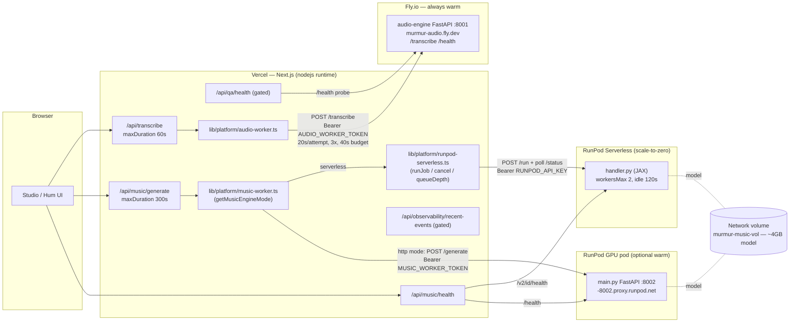

# Worker Architecture — Deployment & Monitoring

Status: current-state reference (closes #220). Documents what the two Python
workers actually ship as, how the Next.js app reaches them, and what
observability exists today. Every claim cites a `file:path`; where behaviour is
ambiguous it is called out rather than guessed.

Murmur runs two independent auxiliary services under `workers/`, each fronted by
its own Next.js API route:

| Engine | Job | Code | Runtime infra | Prod transport |
| --- | --- | --- | --- | --- |
| **Audio engine** | Hum → pitch transcription | `workers/audio-engine/` (FastAPI, `main.py`) | Fly.io, always-warm CPU machine | Long-lived HTTPS |
| **Music engine** | Prompt/hum → Magenta clip | `workers/music-engine/` (one core `engine.py`, two frontends) | RunPod (Serverless **or** GPU pod) | Async job queue, or warm-pod HTTP |

The app never imports worker code. Both are reached over HTTP behind a
server-side adapter in `src/lib/platform/`, so route handlers stay thin and the
transport is swappable by env var.

---

## 1. Audio engine (transcription)

### 1.1 What ships

`workers/audio-engine/main.py` is a ~2,100-line FastAPI app exposing three
routes (`workers/audio-engine/main.py:1943` `POST /transcribe`,
`:2115` `GET /health`, `:2134` `GET /`). It decodes an uploaded hum to 22.05 kHz
mono and runs a configurable pitch-detection stack (RMVPE / SwiftF0 / pYIN /
YIN / parselmouth — see `workers/audio-engine/audio_engine/*_provider.py`). The
container listens on port **8001** (`workers/audio-engine/Dockerfile:38,41`).

### 1.2 Deployment (Fly.io)

Configured by `workers/audio-engine/fly.toml`:

- App `murmur-audio`, `primary_region = "iad"` (`fly.toml:7-8`).
- **Always warm**: `auto_stop_machines = false`, `min_machines_running = 1`
  (`fly.toml:30,32`). The header comment (`fly.toml:1-6,28-29`) states the
  intent explicitly — model warmup must finish before a user waits, and this
  replaced an earlier home-Mac + cloudflared quick-tunnel setup so production no
  longer depends on a laptop being awake.
- VM `shared-cpu-1x`, `1gb` (`fly.toml:41-43`).
- Fly HTTP health check: `GET /health` every `15s`, `40s` grace, `5s` timeout
  (`fly.toml:34-39`).

**Deploy command:** `fly deploy ./workers/audio-engine`
(`docs/DEPLOY_MUSIC_ENGINE.md:44,50`; equivalently `fly deploy -c
workers/audio-engine/fly.toml` per `fly.toml:6`). The bearer token is the Fly
secret `AUDIO_WORKER_TOKEN` (`docs/DEPLOY_MUSIC_ENGINE.md:50`). Deploys are
**manual** — no CI workflow deploys this worker (see §4.4).

Stable production URL: `https://murmur-audio.fly.dev`
(`docs/DEPLOY_MUSIC_ENGINE.md:44`).

### 1.3 Auth

Every request passes the `require_worker_auth` dependency
(`workers/audio-engine/main.py:292-302`, wired at `:1943`), a constant-time
`hmac.compare_digest` check of `Authorization: Bearer <AUDIO_WORKER_TOKEN>`.
`require_worker_token()` (`main.py:336-347`) makes the token **mandatory** when
`AUDIO_WORKER_REQUIRE_AUTH=1` (set in `fly.toml:23`), `WORKER_REQUIRE_AUTH`,
`NODE_ENV/…=production`, or when bound outside loopback; loopback dev may run
unauthenticated with a logged warning.

### 1.4 How the web app reaches it

`src/lib/platform/audio-worker.ts` owns the call. `getAudioWorkerUrl()`
(`audio-worker.ts:399-401`) reads **`AUDIO_WORKER_URL`** (no dev fallback — unset
throws `worker_unconfigured` / 503, `audio-worker.ts:170-177`). The token is
`AUDIO_WORKER_TOKEN` (`audio-worker.ts:182`), sent as a bearer header
(`:267-270`). The request is `multipart/form-data` (`audio`, `targetInstrument`,
optional `pitchProvider`) POSTed to `<base>/transcribe` (`:179-181,260-265`).

The route entrypoint is `src/app/api/transcribe/route.ts` (`runtime = "nodejs"`,
`maxDuration = 60`, `route.ts:33-35`), which calls `transcribeWithAudioWorker`
(`route.ts:6,220,720`).

### 1.5 Timeouts, retries, budgets

All in `src/lib/platform/audio-worker.ts:29-33` and deliberately kept **under**
the route's 60s `maxDuration` so a transient blip retries inside the same
request:

| Constant | Value | Meaning |
| --- | --- | --- |
| `WORKER_ATTEMPT_TIMEOUT_MS` | 20,000 | per-attempt fetch timeout (`AbortSignal.timeout`, `:279`) |
| `WORKER_TOTAL_BUDGET_MS` | 40,000 | total wall-clock across retries (`:189`) |
| `WORKER_MAX_ATTEMPTS` | 3 | attempt cap (`:192`) |
| `WORKER_RETRY_BACKOFF_MS` | [500, 1500] | backoff between attempts (`:197-201`) |
| `MIN_ATTEMPT_BUDGET_MS` | 3,000 | stop retrying below this remaining budget (`:194,205`) |

Retry classification (`audio-worker.ts:281-306`): connection/DNS/TLS/timeout
errors and worker **5xx** are `retryable`; other **4xx** are not. A `422` with
`no_voiced_frames` is surfaced as a terminal user-facing error, not retried
(`:294-296`). The upload is buffered once (`:185`) so each retry sends a fresh
body.

### 1.6 Health

`GET /health` (`workers/audio-engine/main.py:2115-2131`) returns
`{status, service, provider, denoiseProvider, detectorsReady, detectors}`. If no
detector in the configured stack warmed up it returns **HTTP 503** so Fly
restarts / routes away instead of serving a machine that would 503 every
`/transcribe` (`main.py:2126-2130`).

---

## 2. Music engine (Magenta generation)

### 2.1 What ships

`workers/music-engine/` wraps Magenta RealTime 2. One **backend-agnostic core**
`engine.py` (`MAGENTA_MODEL` default `mrt2_base`, `MAGENTA_BACKEND` auto/mlx/jax,
`workers/music-engine/engine.py:35-37,80`) is driven by two frontends
(`workers/music-engine/README.md:6-14`):

- **`main.py`** — local-dev FastAPI HTTP server on `:8002`, run via
  `bun run dev:music` (`main.py:1-29`, `package.json:24`). Generation is
  serialized on a single dedicated thread because MLX binds its GPU stream to
  the loading thread (`main.py:66-70`).
- **`handler.py`** — production **RunPod Serverless** queue handler (JAX/CUDA);
  no worker-side token because RunPod's gateway authenticates the caller
  (`handler.py:1-21`). Model is warmed at import (`handler.py:110-116`).

Both are baked into one Docker image `ghcr.io/p-to-q/murmur-music-engine:latest`
(`scripts/deploy-music-serverless.ts:51-53`). `docker-entrypoint.sh` downloads
the ~4 GB model **once** onto the network volume mounted at `/runpod-volume`
(symlinked so it persists across cold starts), then dispatches on
`MUSIC_ENGINE_ROLE` (`handler` default → `handler.py`; `server` → uvicorn on
`MUSIC_ENGINE_PORT` for a GPU pod).

### 2.2 Two production transports & mode selection

`src/lib/platform/music-worker.ts` resolves which transport serves a request:

- **`serverless`** — RunPod Serverless endpoint. Config = `RUNPOD_SERVERLESS_ENDPOINT_ID`
  + `RUNPOD_API_KEY` (`music-worker.ts:27-32`). Scale-to-zero: cheap idle, but a
  cold start can run **minutes** (`music-worker.ts:5-8`).
- **`http`** — long-lived HTTP worker: `MUSIC_WORKER_URL` + `MUSIC_WORKER_TOKEN`
  (`music-worker.ts:35-40`). Either a RunPod GPU **pod** running `main.py`, or
  the local `bun run dev:music` worker on `127.0.0.1:8002` (dev fallback when
  unset, non-prod only, `:38`).

`getMusicEngineMode()` (`music-worker.ts:60-73`) picks the transport:

- **Production**: an explicit `MUSIC_ENGINE_MODE` is authoritative
  (`serverless` | `http`; `pod`/`worker` alias to `http`, `:44-48`) so failover
  can't silently land on the wrong transport. `auto`/unset → **serverless wins**
  when configured, else `http`.

Transport selection and paid-delivery support are intentionally separate. The
durable job receipt, request-hash fence, object-store artifact, and exact replay
path currently target Serverless. In production, a stable-clip request selected
to `http` therefore fails before billing; HTTP remains available for local
development and explicit health/canary validation until it implements the same
durable contract.
- **Non-production**: falls back to the other transport to keep demos alive.

### 2.3 Serverless client — submit / poll / cancel

`src/lib/platform/runpod-serverless.ts` talks to `https://api.runpod.ai/v2`
(`:15`). It submits async (`POST /run`) and **polls** (`GET /status/{id}`) rather
than `/runsync`, because a cold start blows the synchronous window
(`runpod-serverless.ts:1-11`, `runJob` at `:183`). Key policy:

| Constant / behaviour | Value | Source |
| --- | --- | --- |
| `DEFAULT_POLL_INTERVAL_MS` | 1,500 | `:16,189` |
| `PER_CALL_TIMEOUT_MS` | 20,000 | per `/run` or `/status` call cap (`:20`) |
| `MAX_CONSECUTIVE_POLL_FAILURES` | 5 | transient `/status` blips tolerated before giving up (`:25,237,257`) |
| `JOB_TTL_MS` | 600,000 (clamp 360k–86.4M, env `RUNPOD_JOB_TTL_MS`) | total job lifespan so orphans self-reap (`:45,200`) |
| `JOB_EXECUTION_TIMEOUT_MS` | 180,000 (env `RUNPOD_JOB_EXECUTION_TIMEOUT_MS`) | cap on active processing (`:46-51,200`) |

Transient `/status` failures (thrown fetch, 429, 5xx) are retried in place — the
poll is idempotent and the job keeps generating (`:229-273`). On caller abort
(browser disconnect via `signal`) or timeout, `cancelJob` (`POST /cancel/{id}`,
`:163-172`) is **awaited** so the job stops squatting a worker (`:223-225,283`).
`RunpodError` is tagged (`unauthorized`/`http`/`failed`/`timeout`/`aborted`,
`:59-64`) for the route to map to its error contract.

### 2.4 Cold-start behaviour & load-shedding

The generate route `src/app/api/music/generate/route.ts` (`runtime = "nodejs"`,
`maxDuration = 300`, `route.ts:33-36`) budgets `WORKER_TIMEOUT_MS = 295_000`
(`:47`) — just under the Vercel Pro 300s ceiling so a structured error beats the
platform 502.

**Pre-flight load-shed (#230)** (`route.ts:53-54,180-212`): before spending a
note, if `mode === "serverless"` and `getQueueDepth().inQueue >
LOAD_SHED_QUEUE_THRESHOLD (5)`, the route returns **503 `worker_overloaded`**
with `Retry-After: 15s` (`LOAD_SHED_RETRY_AFTER_MS = 15_000`). This runs for
every account kind so a deep cold queue never charges a note it can't deliver.
`getQueueDepth` **fails open** (null → allow, `runpod-serverless.ts:350-360`).

Billing: each handoff spends **1 note** preflight and refunds on failure;
in-request refund failure writes a durable `refund:pending` marker (#232) for the
reconcile cron (`route.ts:127-384,604-730`). Rate limits: burst 6/60s, daily
48/24h (`route.ts:41-45`).

Transport-specific bodies: serverless sends JSON with base64 hum/audio
(`generateViaServerless`, `route.ts:733-814`); http sends multipart
(`generateViaHttp`, `:817-904`).

### 2.5 Deploy — serverless

`bun run deploy:music-serverless` → `scripts/deploy-music-serverless.ts`
(`package.json:14-15`; `deploy:music-gpu` is an alias). Uses the RunPod REST API
(`https://rest.runpod.io/v1`, `:40`) to idempotently ensure:

- **Network volume** `murmur-music-vol`, 50 GB, default DC `EU-RO-1`
  (`:43-47,232-254`) — holds the model so it downloads once.
- **Template** `murmur-music-serverless`, container disk 30 GB, env
  `MAGENTA_BACKEND=jax` / `MAGENTA_MODEL` / `MUSIC_ENGINE_PRELOAD=1`
  (`:256-289`).
- **Endpoint** `murmur-music-serverless`: `workersMin 0`, `workersMax 2`
  (env `RUNPOD_WORKERS_MAX`), `idleTimeout 120s` (env `RUNPOD_IDLE_TIMEOUT`),
  `flashboot: true`, `scalerType QUEUE_DELAY` value 4, `executionTimeoutMs
  180000` (`:291-325`). GPU candidates L4 → 4090 → A5000 → 3090 → A6000
  (`:58-65`).

`WARMUP` (default on) submits a 2s job and waits up to ~20 min for the first
cold pull + model download (`:106-120,327-374`). `VERCEL=1` runs `vercel env
add` for `RUNPOD_SERVERLESS_ENDPOINT_ID` / `RUNPOD_API_KEY` /
`MUSIC_ENGINE_MODE=serverless` and `vercel --prod` (`:389-404`).

Reusing existing template/endpoint is intentional — RunPod's `PATCH` rejects the
create body, so image/env changes need a console delete + redeploy
(`:279-289,317-322`). Note: `:latest` means cold workers always pull the newest
image.

The image itself is built by CI **`.github/workflows/music-engine-gpu-image.yml`**
on push to `main` touching `workers/music-engine/**` (or `workflow_dispatch`),
pushed to GHCR and made public so the endpoint pulls without registry auth.

### 2.6 Deploy — warm GPU pod (the `http` failover)

`scripts/music-pod.ts` (`package.json:16-19`): `pod:create` / `pod:start` /
`pod:stop` / `pod:status`. Same image, `MUSIC_ENGINE_ROLE=server` → FastAPI on
`:8002`, reachable at `https://<podId>-8002.proxy.runpod.net`
(`music-pod.ts:1-9,301-303`). It attaches the **same** network volume the
serverless endpoint primes, so a stopped→started pod is warm in seconds, not
minutes (`:11-14`). GPU candidates default to A5000 (`:54-61`).

`VERCEL=1` on create/start pushes `MUSIC_ENGINE_MODE=http` +
`MUSIC_WORKER_URL`/`MUSIC_WORKER_TOKEN` and redeploys (`:176-188,362-378`);
`pod:stop VERCEL=1 SWITCH=1` flips prod back to `serverless` (`:130-143`). The
pod's proxy URL changes each time it is recreated — it is persisted to
`.env.music-pod` and re-synced (`:351-360`). This is the documented remedy when
serverless cold-start latency is unacceptable.

### 2.7 Health

- Dev/pod worker `GET /health` (`main.py:150-159`): `{status (ok|degraded),
  mock, model, loaded, loading, loadError}`.
- Serverless has no HTTP `/health` of its own; the app reads RunPod's endpoint
  health (`GET /v2/{id}/health`, `endpointHealth`, `runpod-serverless.ts:294-301`)
  and parses worker/job counts (`parseQueueDepth`, `:323-342`).

---

## 3. System diagram

---

## 4. Monitoring & observability (today)

### 4.1 Health endpoints (pull)

| Endpoint | Covers | Gating | Source |
| --- | --- | --- | --- |
| `GET /api/music/health` | Music transport availability + `estimatedWaitMs` | public (minimal shape) | `src/app/api/music/health/route.ts` |
| `GET /api/qa/health` | Web + audio-worker `/health` probe (3s timeout) + QA route list | debug-surface gated | `src/app/api/qa/health/route.ts` |
| Worker `GET /health` | audio & music worker self-report | worker-local | `workers/*/main.py` |

`/api/music/health` (`route.ts:35-149`) reports transport `mode` + a coarse
`reason`, deliberately hiding worker counts / model names / raw load errors so it
"cannot leak deployment shape" (`:29-34`). For serverless, "reachable" =
available — a scale-to-zero endpoint reports 0 workers but still accepts
cold-starting jobs (`:20-28,48-91`). Wait estimate uses `AVG_GENERATION_MS
30_000` and `COLD_START_MS 45_000` (`:151-166`).

### 4.2 Structured logs

`src/lib/observability/log.ts` emits one OpenTelemetry-shaped JSON line per event
(`log()`, `:110-153`) with `service: "web"`, release id, `requestId/userId/
sessionId/route/durationMs`, and an `ext` bag. `LogEvent` is a typed union
(`:13-91`) — names are dashboard/incident contracts (renames forbidden). Worker
events include `transcribe.*`, `music.generate_{requested,completed,failed}`,
`magenta.{batch_started,clip_ready,clip_failed}`, `notes.*`,
`rate_limit.tripped`. The generate route emits `music.generate_requested/
completed/failed` with `mode`, `billingMode`, `budget_exceeded`, and load-shed
context (`route.ts:185-194,272-335,918-933`). The log helper intentionally
refuses raw audio / full melody arrays / emails (`log.ts:103-109`).

### 4.3 Recent-events ring buffer + latency budgets

`src/lib/observability/recent-events.ts` is a tiny in-memory ring buffer
(`BUFFER_LIMIT = 32`, `:24`) pinned to `globalThis` (`:44-50`) that `log()`
feeds automatically (`log.ts:131-141`). It redacts keys starting `raw`/`audio`
and truncates >2048-char fields (`recent-events.ts:26,91-109`). Served by
`GET /api/observability/recent-events` (prod requires
`MURMUR_ENABLE_DEBUG_SURFACE=true`, `route.ts:24-35`).

`src/lib/observability/latency-budgets.ts` defines P50/P95 ceilings; `checkBudget`
sets a `budget_exceeded` flag on the log rather than enforcing a limit
(`:1-7,46-57`). Worker-relevant budgets: `transcribe` 8s/20s, `transcribe.worker`
6s/16s, `music_generate` 30s/120s, `music_generate.worker` 25s/100s (`:24-33`).
Both `/api/transcribe` and `/api/music/generate` call `checkBudget`
(`transcribe/route.ts:287,748`, `music/generate/route.ts:318-319`).

### 4.4 Gaps (call-outs, not fixes)

- **Ring buffer is not a metrics backend.** Single-process, in-memory, max 32
  events, no persistence (`recent-events.ts:1-12`); its own header says it
  downgrades to a local overlay once a real vendor backend ships.
- **Music events are not in the ring buffer.** `TRACKED_EVENTS`
  (`recent-events.ts:14-22`) only lists `transcribe.*` / `capture.*` /
  `arrangement.generated` — `music.generate_*` and `magenta.*` reach stdout logs
  but not the recent-events surface.
- **Health is pull, not push.** Fly runs an interval `/health` check
  (`fly.toml:34-39`); nothing polls `/api/music/health` or aggregates worker
  health, and no alerting is wired in-repo.
- **Worker deploys are manual.** CI only builds the music image
  (`music-engine-gpu-image.yml`) and runs a scheduled audio-acceptance suite
  (`audio-acceptance.yml`); the Fly audio deploy and the RunPod endpoint/pod
  apply are operator-run scripts. The warm-pod proxy URL changes on every
  recreate (`music-pod.ts:351-360`).
- **Latency budgets are static targets** with no aggregation/percentile store in
  the repo — `budget_exceeded` is a per-event flag on the JSON line only.

---

## 5. Environment variables

### 5.1 Audio engine

| Var | Where | Purpose |
| --- | --- | --- |
| `AUDIO_WORKER_URL` | Vercel (web) | worker base URL; unset → 503 `worker_unconfigured` (`audio-worker.ts:399-401`) |
| `AUDIO_WORKER_TOKEN` | Vercel (web) + Fly secret (worker) | shared bearer token (`audio-worker.ts:182`, `main.py:293`) |
| `AUDIO_WORKER_REQUIRE_AUTH` | Fly (`=1`) | force token requirement (`fly.toml:23`, `main.py:329`) |
| `AUDIO_ENGINE_PITCH_PROVIDER` | Fly (`auto`) | detector stack (`fly.toml:18`) |
| `AUDIO_ENGINE_RMVPE_MODEL_PATH` / `_DEVICE` / `_ALLOW_DOWNLOAD` / `_CONFIDENCE_THRESHOLD` | Fly | RMVPE config (`fly.toml:19-22`) |
| `MURMUR_CAPTURE_HUMS` | Fly (`0`) | ephemeral disk → don't persist hums (`fly.toml:15`, `main.py:152`) |

### 5.2 Music engine

| Var | Where | Purpose |
| --- | --- | --- |
| `MUSIC_ENGINE_MODE` | Vercel | `serverless`\|`http`\|`pod`\|`worker`\|`auto`; authoritative in prod (`music-worker.ts:43-73`) |
| `RUNPOD_SERVERLESS_ENDPOINT_ID` | Vercel | serverless endpoint id (`music-worker.ts:28`) |
| `RUNPOD_API_KEY` | Vercel | bearer for RunPod API (`music-worker.ts:29`, `runpod-serverless.ts:111`) |
| `MUSIC_WORKER_URL` | Vercel | http/pod worker base (`music-worker.ts:35-40`) |
| `MUSIC_WORKER_TOKEN` | Vercel + pod | http-mode bearer (`generate/route.ts:839`, `main.py:138`) |
| `RUNPOD_JOB_TTL_MS` / `RUNPOD_JOB_EXECUTION_TIMEOUT_MS` | Vercel (optional) | job policy overrides (`runpod-serverless.ts:45-46`) |
| `MAGENTA_MODEL` / `MAGENTA_BACKEND` / `MAGENTA_CFG_NOTES` | worker/template | model + backend (`engine.py:35-37,80`; `deploy-music-serverless.ts:256-263`) |
| `MUSIC_ENGINE_PRELOAD` | worker | warm model at start (`engine.py:37`) |
| `MUSIC_ENGINE_ROLE` / `MUSIC_ENGINE_PORT` | pod | `handler` vs `server` (`docker-entrypoint.sh`; `music-pod.ts:234-247`) |
| `MUSIC_ENGINE_MOCK` | worker (dev) | synthesized placeholder clips (`engine.py:35`) |
| `RUNPOD_WORKERS_MAX` / `RUNPOD_IDLE_TIMEOUT` / `RUNPOD_GPU_TYPE_ID` / `RUNPOD_NETWORK_VOLUME_ID` / `RUNPOD_DATA_CENTER_ID` | deploy script | endpoint provisioning (`deploy-music-serverless.ts:17-22,54-65`) |
| `MURMUR_ENABLE_DEBUG_SURFACE` | Vercel | expose recent-events in prod (`debug-surface.ts:7-11`) |

---

## 6. Deploy command reference

| Target | Command | Script / config |
| --- | --- | --- |
| Audio engine (Fly) | `fly deploy ./workers/audio-engine` | `workers/audio-engine/fly.toml` |
| Music image (GHCR) | push to `main` touching `workers/music-engine/**` (auto) | `.github/workflows/music-engine-gpu-image.yml` |
| Music serverless | `RUNPOD_API_KEY=… VERCEL=1 bun run deploy:music-serverless` | `scripts/deploy-music-serverless.ts` |
| Music warm pod | `bun run pod:create` \| `pod:start` \| `pod:stop` \| `pod:status` | `scripts/music-pod.ts` |
| Audio worker (local) | `bun run dev:audio` (uvicorn `127.0.0.1:8001`) | `package.json:23` |
| Music worker (local) | `bun run dev:music` (uvicorn `127.0.0.1:8002`) | `package.json:24` |

See also `docs/DEPLOY_MUSIC_ENGINE.md`, `docs/DEPLOY_MUSIC_ENGINE_GPU.md`,
`docs/music-engine.md`, and `docs/observability.md`.
